# A propos de Castrvm

Castrvm est une application web de location de châteaux.

*En attente d'un déploiement prochain, découvrez les fonctionnalités de Castrvm.*

## Accueil

Page d'entrée sur le site

  

Accueil

  <a href="https://github.com/jadc96/castrvm/blob/master/app/assets/images/accueil.png">
    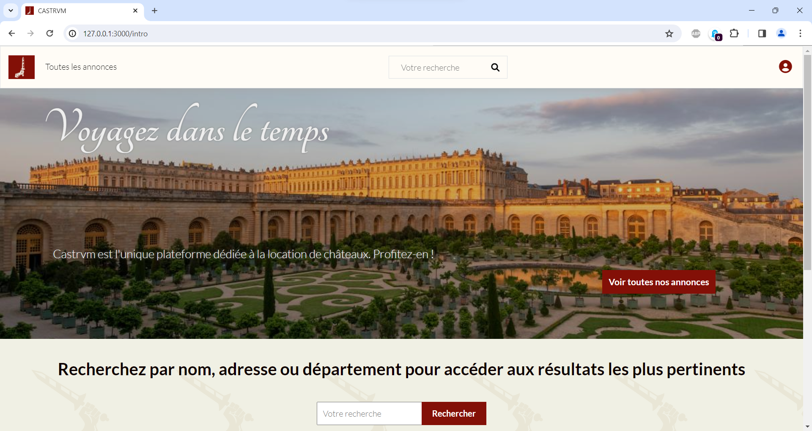
  </a>

## Connexion, création de compte

Se connecter ou créer un compte pour accéder à toutes les fonctionnalités (devise)

  <a href="https://github.com/jadc96/castrvm/blob/master/app/assets/images/connexion.png">
    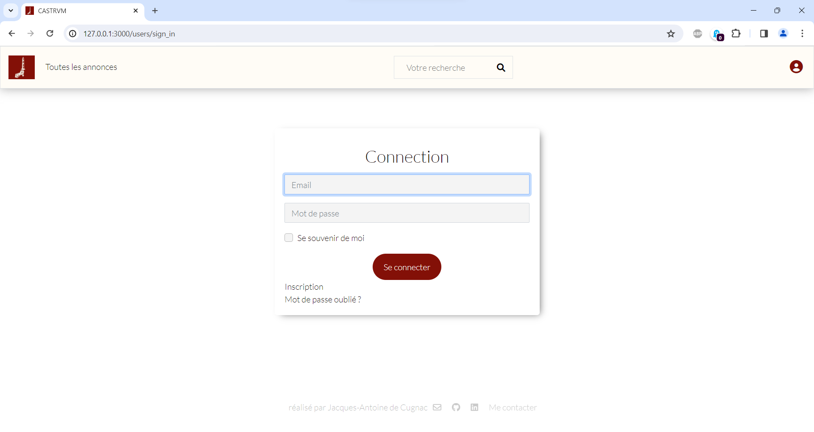
  </a>

## Consulter les annonces

Consulter la liste d'annonces

  <a href="https://github.com/jadc96/castrvm/blob/master/app/assets/images/liste-annonces.png">
    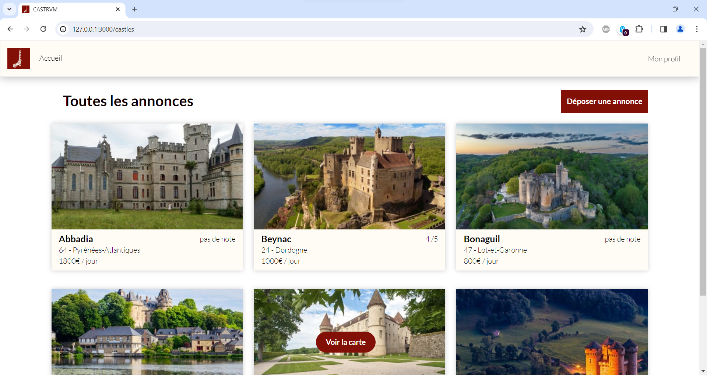
  </a>

Consulter les annonces selon la répartition géographiques (geocoder)

  

## Publier une annonce

Remplir les champs obligatoires

  <a href="https://github.com/jadc96/castrvm/blob/master/app/assets/images/annonce-publier.png">
    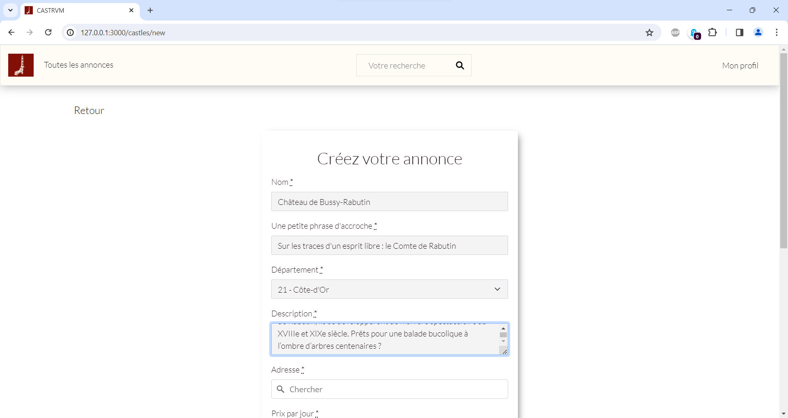
  </a>

Autocomplétion pour le champ adresse (geocoder)

  <a href="https://github.com/jadc96/castrvm/blob/master/app/assets/images/annonce-autocomplete.png">
    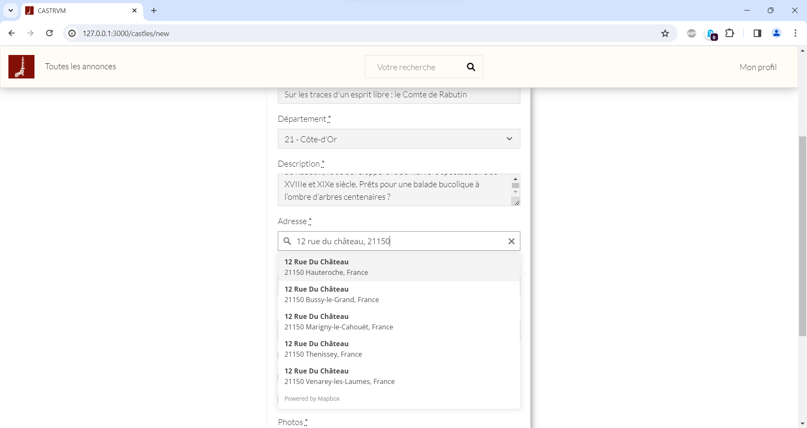
  </a>

Publier l'annonce...

  

...et la consulter !

  <a href="https://github.com/jadc96/castrvm/blob/master/app/assets/images/annonce-consulter.png">
    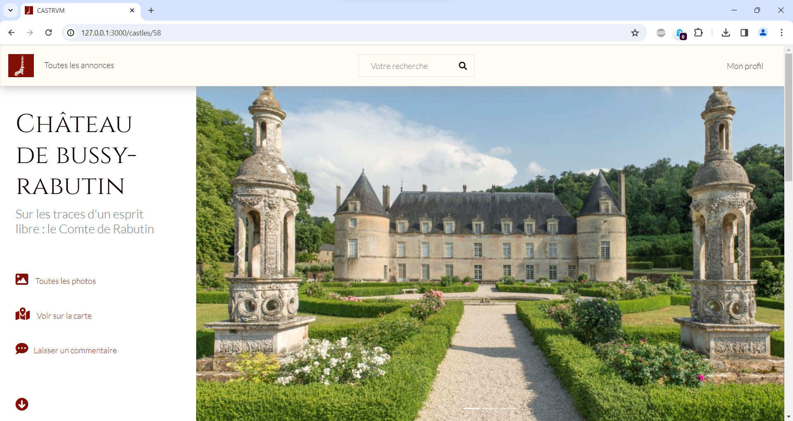
  </a>

  

  <a href="https://github.com/jadc96/castrvm/blob/master/app/assets/images/annonce-description.png">
    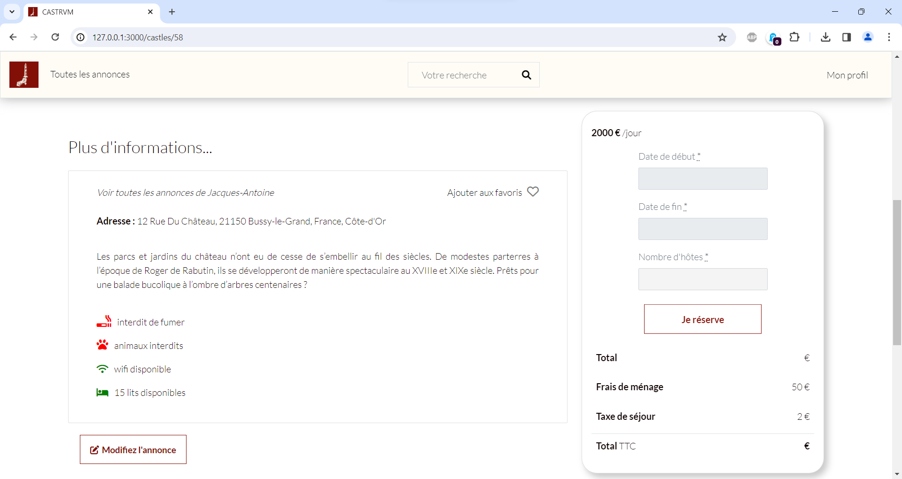
  </a>

Afficher toutes les photos

  <a href="https://github.com/jadc96/castrvm/blob/master/app/assets/images/annonce-photos.png">
    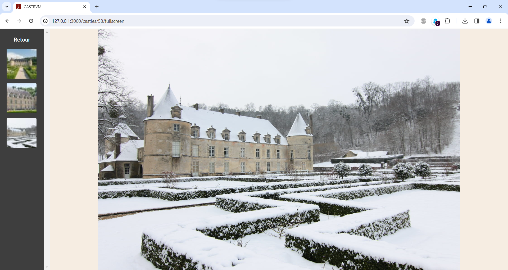
  </a>

## Effectuer une réservation

Sélectionner les dates (flatpickr)

  <a href="https://github.com/jadc96/castrvm/blob/master/app/assets/images/réserver-dates.png">
    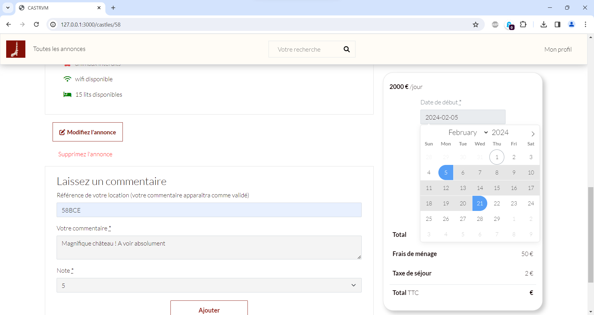
  </a>

Calcul automatique du prix et validation

  <a href="https://github.com/jadc96/castrvm/blob/master/app/assets/images/réserver-valider.png">
    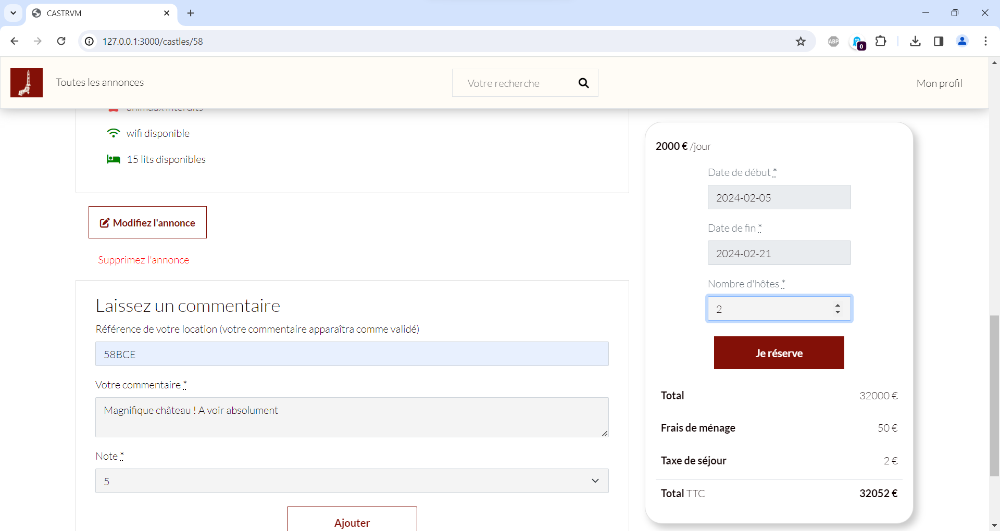
  </a>

Affichage de la réservation

  <a href="https://github.com/jadc96/castrvm/blob/master/app/assets/images/réserver-afficher.png">
    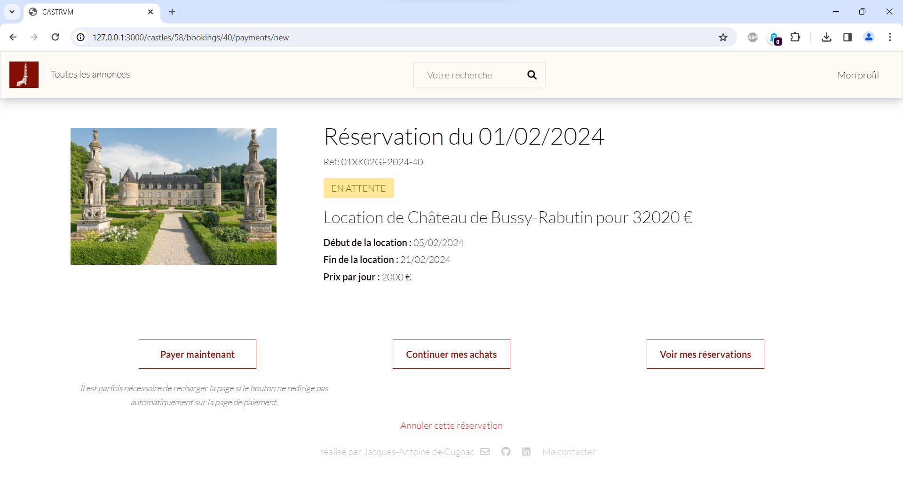
  </a>

Paiement (stripe)

  <a href="https://github.com/jadc96/castrvm/blob/master/app/assets/images/réserver-payer.png">
    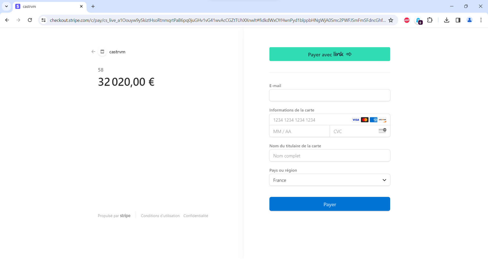
  </a>

Consulter toutes ses réservations, en attente ou passées

  <a href="https://github.com/jadc96/castrvm/blob/master/app/assets/images/réservations-en-cours.png">
    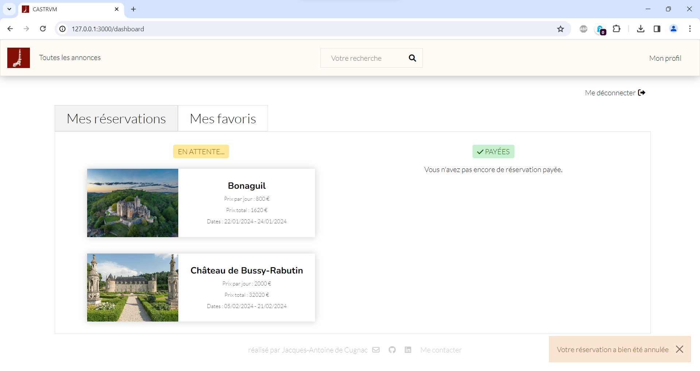
  </a>

## Favoris

  

## Publier des commentaires

  <a href="https://github.com/jadc96/castrvm/blob/master/app/assets/images/commentaire-publier.png">
    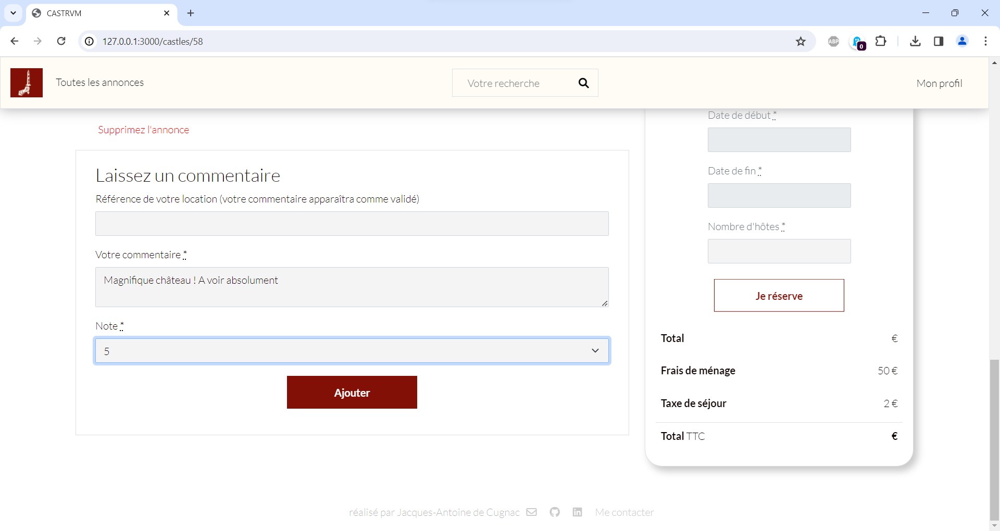
  </a>

  <a href="https://github.com/jadc96/castrvm/blob/master/app/assets/images/commentaire-affichage.png">
    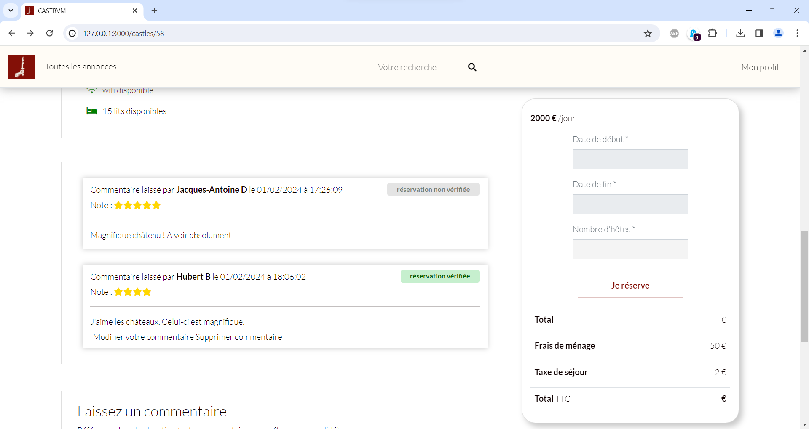
  </a>

## Bibliothèques utilisées

- Devise (authentification)
- Stripe (paiement)
- Pundit (autorisation)
- Geocoder (localisation)
- Flatpickr (calendrier)
